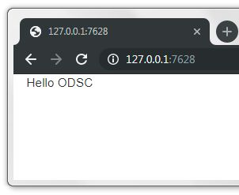
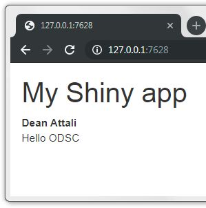
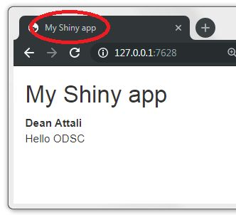
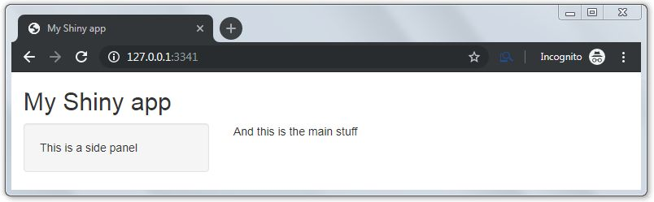
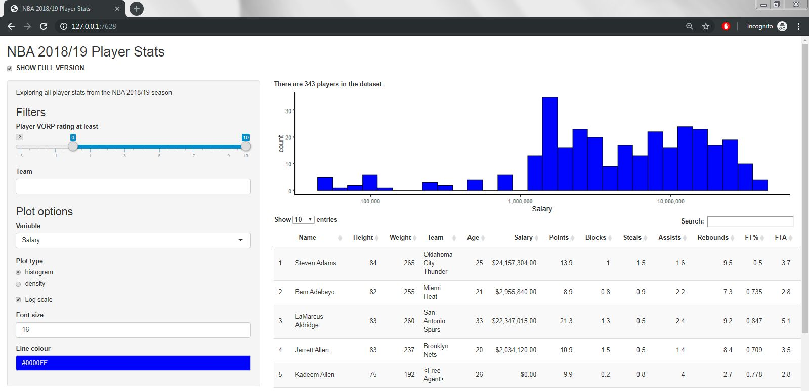
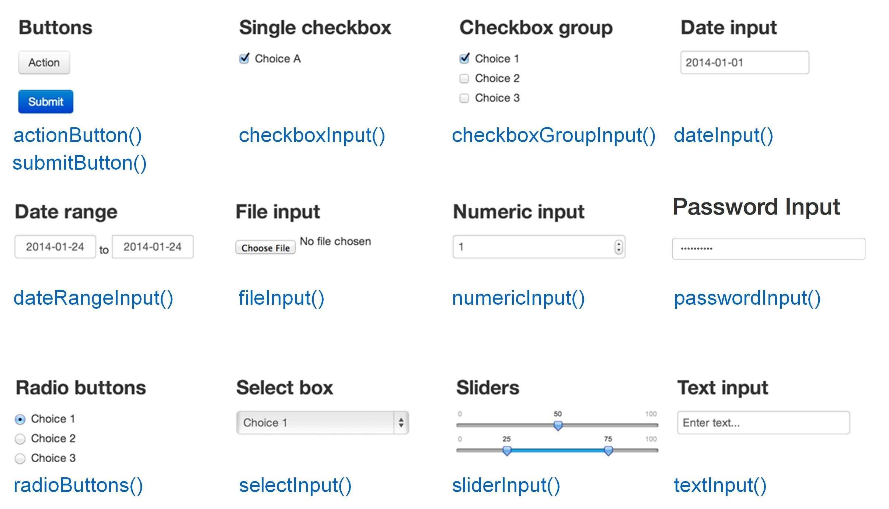
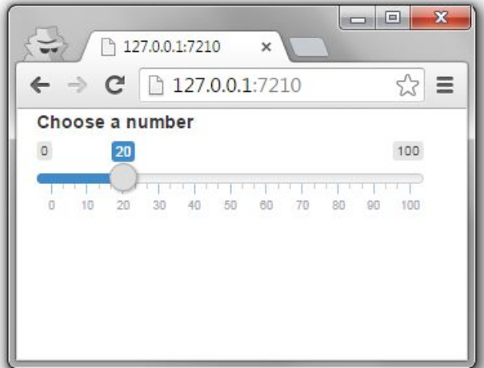
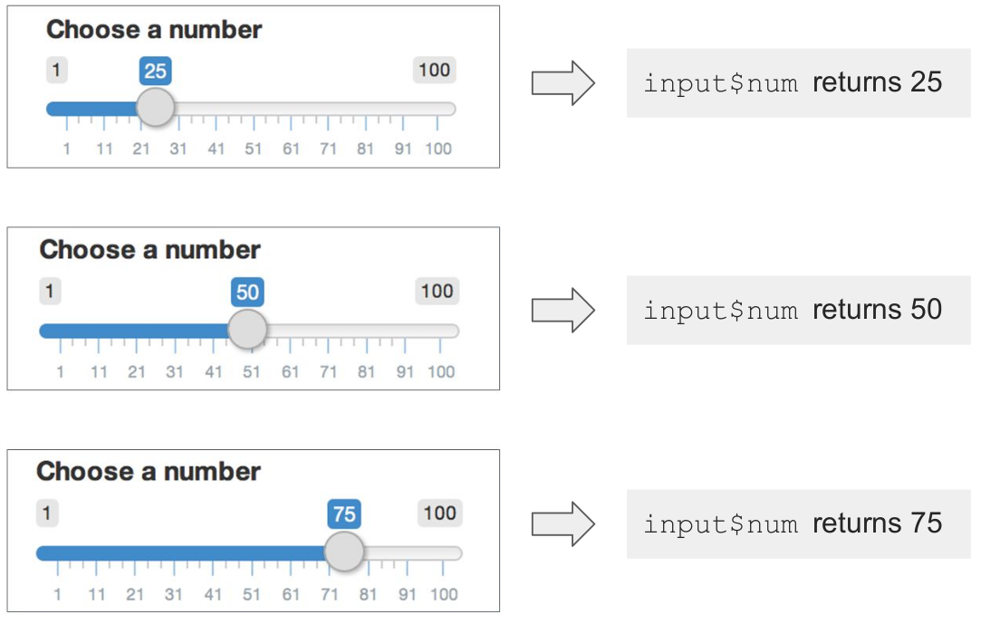
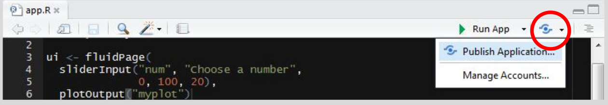

```{r setup, include=FALSE}
options(htmltools.dir.version = FALSE)
knitr::opts_chunk$set(echo = FALSE, fig.align = "center")
library(knitr);library(DT);library(shiny)
```


layout: true

<div class="my-footer"><span><a href="https://www.zarathu.com">Zarathu Co.,Ltd</a>   
&emsp;&emsp;&emsp;&emsp;&emsp;&emsp;&emsp;&emsp;&emsp;&emsp;&emsp;&emsp;&emsp;
&emsp;&emsp;&emsp;&emsp;&emsp;&emsp;&emsp;&emsp;&emsp;&emsp;&emsp;&emsp;&emsp;
<a href="https://github.com/jinseob2kim">김진섭</a></span></div> 

---

# 실습 목표

.large[
 * [RStudio cloud](https://rstudio.cloud/) 를 이용, 클라우드 환경에서 R을 쓸 수 있다.
]

--

.large[
 * `app.R` 파일에 Shiny의 **ui**와 **server** 코드를 입력할 수 있다.
 
 
 * `fluidPage`의 `sidebarLayout` 레이아웃을 이용, 왼쪽에는 UI 옵션, 오른쪽에는 해당되는 결과를 보여줄 수 있다.
 
 
 * [DT](https://rstudio.github.io/DT/) 패키지로 데이터를, [ggplot2](https://ggplot2.tidyverse.org/) 로 히스토그램을 보여줄 수 있다. 
]


--
.large[
 * **Reactivity** 를 이해한다.  
]

--
.large[
 * [shinyapps.io](https://www.shinyapps.io/) 에 app 을 배포할 수 있다. 
]


---

# Shiny 예

.large[
* [공식 갤러리](https://shiny.rstudio.com/gallery/)


* [유저 앱 모음](http://www.showmeshiny.com/)


* [통계분석 웹 by Zarathu](http://app.zarathu.com/) 


* [네트워크분석 by Zarathu]()


* [심장 압력 계산 by Zarathu]()


* [압축 파일에 담긴 결과 보기 by Zarathu](http://147.47.68.165:1111/cdm/estimation)
]


---

class: center, middle

# 시작하기 전에


---

# [RStudio cloud](https://rstudio.cloud/)

.large[
 * **클라우드 환경**에서 RStudio 무료 이용.
 
 
 * 성능은 나쁘지만(1 코어, 램 1기가), 실습용으론 충분.
]


<a href="https://rstudio.cloud/"></a>


---

# 실습환경 만들기: RStudio cloud 

**Step 1:** https://rstudio.cloud 회원 가입

**Step 2:** https://rstudio.cloud/spaces/30306/join?access_code=s4hEiPXQF%2BjosPclQEzgTtR0mPWDuh7Dhr2O7wAg 들어가서 **"Join Space"** 클릭

**Step 3:** 위쪽 **"Projects"** 클릭 후, **"New Project"** 를 눌러 **"New Project from Git Repo"** 선택. Repo 주소는 https://github.com/jinseob2kim/shiny-workshop-odsc2019.


모든 강의자료는 RStudio cloud 에 들어 있습니다. 


---

# 실습환경 만들기: 개인 PC

**Step 1:** 패키지 설치

```r
install.packages(c("shiny", "ggplot2", "dplyr", "DT", "colourpicker", "readr")) 
```


<br>
**Step 2:** https://github.com/jinseob2kim/shiny-workshop-odsc2019 들어간 후 

<br>

**Step 3:** 녹색 **"Clone or download"** 클릭 후 **"Download ZIP"** 을 눌러 자료 다운. 


---

# 실습파일 

.large[
* `app_01.R` - `app_09.R`: 9단계 문제 


* `app_01_sol.R` - `app_09_sol.R`: 해답


* `app_full_version.R`: [최종 완성 앱](https://daattali.shinyapps.io/nba2018/)


* **data** 폴더: [Kaggle의 NBA 2018/19 시즌 스탯 데이터](https://www.kaggle.com/schmadam97/nba-regular-season-stats-20182019)


* **docs** 폴더: 이 슬라이드 파일 

]


---

class: center, middle

# Shiny 소개


---

### [Shiny](https://shiny.rstudio.com/) is an R package that makes it easy to **build web applications with R**


```{r, align = "center"}
include_graphics("rs.png")
```

---

# 웹 개발 지식 없어도 됨

```{r, align = "center"}
include_graphics("css.png")
```


---

# Shiny app

```{r, align = "center"}
include_graphics("ui.png")
```

---

# UI & SERVER

```{r, align = "center"}
include_graphics("ui2.png")
```


---

# UI & SERVER

<center>
<a href="https://codingclubuc3m.rbind.io/post/2018-06-19/"></a>
</center>


---

# Make basic App

* `app.R` 파일 만들고(**이름 바뀌면 안됨**)

* `ui` 와 `server` 코드 작성 후 `shinyApp` 으로 마무리. **Run App** 눌러 실행.

  - `ui.R`, `server.R` 따로 작성할 수도 있음. 개인 취향


```{r, align = "center"}
include_graphics("basic.png")
```


---

# Stop App

**ESC** or 빨간 **Stop** 버튼

```{r, align = "center"}
include_graphics("stop.png")
```

---

# 실습: `app_01.R`

.large[
* `shiny` 패키지 로드 후, 아래와 같이 데이터를 읽는다.

```r
players <- read.csv("data/nba2018.csv")
```

* 데이터 확인: **ui** 에 **데이터 행 수** 를 보여주기.


* 데이터 탐색: 선수들 **나이(age), 연봉(salary), 키(height) 의 범위**는?

]


---
class: center, middle

# UI 꾸미기


---
# Add text


```r
library(shiny)

ui <- fluidPage(
  "Hello ODSC"
)

server <- function(input, output, session){

}

shinyApp(ui, server)
```

```{r, align = "center"}

```

---
# Use `html` tags

```r
ui <- fluidPage(
  h1("My Shiny app"),
  strong("Dean Attali"),
  br(),
  "Hello ODSC"
)
```

```{r, align = "center"}

```

---

# [`html` 다른 옵션들](https://shiny.rstudio.com/articles/tag-glossary.html)


```{r, echo = T}
names(tags)
```


---

# `titlePanel()`

```r
ui <- fluidPage(
* titlePanel("My Shiny app"),
  strong("Dean Attali"),
  br(),
  "Hello ODSC"
)
```

```{r, align = "center"}

```


---

# Layout: `sidebarLayout()` 

* 화면 **왼쪽에서 control**, **오른쪽에 결과**: [다양한 Layout](http://shiny.rstudio.com/articles/layout-guide.html) 

```r
fluidPage(
  titlePanel("My Shiny app"),
* sidebarLayout(
*   sidebarPanel(
      "This is a side panel"),
*   mainPanel(
      "And this is the main stuff")
    )
)
```

```{r, align = "center"}

```

---

# Shiny 는 ui 를 `html` 로 바꾼다.

```{r, echo = T}
ui <- fluidPage(
  titlePanel("My Shiny app"),
  sidebarLayout(
   sidebarPanel(
      "This is a side panel"),
   mainPanel(
      "And this is the main stuff")
    )
)

print(ui)
```


---

# 실습: `app_02.R`

.large[
1. `titlePanel` 추가: "NBA 2018/19 Player Stats"

2. `sidebarLayout` 적용

  - `sidebarPanel`: "Exploring all player stats from the NBA 2018/19 season" 쓰기
  
  - `mainPanel`: **굵은 글씨**로 "There are X players in the dataset" (X는 실제 숫자)
  
]


---
class: center, middle

# Inputs and outputs


---

# Inputs and outputs

* 반응형 웹은 유저가 조절할 수 있는 **input** 과 그에 대응하는 **output** 이 있다.

```{r, align = "center"}

```


---

# [Input 종류](https://shiny.rstudio.com/tutorial/written-tutorial/lesson3/images/basic-widgets.png)

```{r, align = "center"}

```


---

# 예: `sliderInput`

```r
library(shiny)
ui <- fluidPage(
* sliderInput(
*   inputId = "num", label = "Choose a number", min = 0, max = 100, 
    value = 20)
* )

server <- function(input, output) {}
shinyApp(ui = ui, server = server)
```

```{r, align = "center", out.width="70%"}

```

---

# Shiny: input $\rightarrow$ `html`

```{r, echo = T}
print(
  sliderInput("num", "Choose a number", min = 0, max = 100, 
              value = 20)
)

```


---

# 범위도 가능 

```r
sliderInput("range", "Age:", min = 0, max = 100, value = c(24, 75))
```

```{r, align = "center", out.width="70%"}
include_graphics("https://i.stack.imgur.com/KsRCZ.jpg")
```

.large[
자세한 옵션은 [링크](https://shiny.rstudio.com/articles/sliders.html) 참고
]


---

# 실습: `app_03.R`

.large[

 * `sidebarPanel` 에 Level 3 header(`h3`) 로 "Filter" 글자 추가. 
 
 
 * 바로 아래에 `sliderInput` 추가
  
    - **id**: "VORP", 
    - **min** -3, **max** 10, **value** 0 
    - **Label**: "Player VORP rating at least"
    
 
 * 바로 아래에 `selectInput` 추가
 
    - **id, label**: "Team", 
    - **choices**: 데이터셋의 모든 팀
    - Default **selected**: "Golden State Warriors"
    - **Label**: "Player VORP rating at least"


]

---

# Outputs

**Step 1**: **UI** 에 output 종류에 따른 코드를 넣는다: `*Output`

<br>
**Step 2**: **Server** 에 output 내용 만드는 코드를 넣는다: `render*`

```{r}
out <- data.table::data.table(`UI Function` = paste0(c("plot", "text", "verbatimText", "table", "ui", "DT"), "Output()"),
                              `Render Function` = paste0("render", c("Plot", "Text", "Print", "Table", "UI", "DT"), "({})"),
                              Output = c("Plot", "Text", "R result", "Table", "Shiny UI element", "table of DT package"))

kable(out, format='html', align = "c")
```


---

# 예: plot

```r
library(shiny)
ui <- fluidPage(
  sliderInput("num", "Choose a number", 0, 100, 20),  ## id: num
* plotOutput("myplot")                                ## id: myplot
  )

server <- function(input, output){
* output$myplot <- renderPlot({                       ## id: myplot
*   plot(rnorm(input$num))                            ## id: num
    })
}

shinyApp(ui = ui, server = server)

```


---

# 실습: `app_04.R`


.large[
 * `mainPanel` 에 `plotOutput` 추가
 
  - **id**: "nba_plot"
  
 
 * 바로 아래에 `tableOutput` 추가
 
  - **id**: "players_data"
  
 
주의! 화면 결과가 바뀌는 건 없다.

]


---

# Using input$

```{r, align = "center"}

```


---

# 실습: `app_05.R`


.large[
 *  `renderText`: **데이터에서 filtering 된 사람 수**  
 
  - **id**: "num_players"

  
 * `renderPlot`: 필터링 데이터에서 **Salay** 값의 히스토그램
 
  - **id**: "nba_plot"

```r  
ggplot(data, aes(Salary)) + geom_histogram()
```

 
 * `renderTable` $\rightarrow$ `renderDT`: [반응형 테이블 DT](https://rstudio.github.io/DT/shiny.html) 
 
  - **id**: "players_data"

]


---
class: center, middle

# Reactivity


---

# Reactive values

.large[
* 모든 **input** 은 **reactive value**.
]

```r
server <- function(input, output) {
  
  output$myplot <- renderPlot({
*   plot(rnorm(input$num))
    })

}
```

.large[
`input$num` 이 변하면 output의 plot 도 변한다.
]


---

# Reactive contexts

.large[
* 모든 **reactive value** 는 **reactive context** 안에서만 적용 가능.


* `render*` 꼴은 전부 **reactive context**
]

```r
server <- function(input, output) {
  
* output$myplot <- renderPlot({
    plot(rnorm(input$num))
    })

}
```


---

# Problem 1

```r
server <- function(input, output) {

* print(input$num)

}
  
# ERROR: Operation not allowed without an active reactive context
```

---

# Solution 1: `observe{()}`

```r
server <- function(input, output) {

* observe({
*  print(input$num)
* })

}

```

2개 이상도 가능.

```r
server <- function(input, output) {

* observe({
*  print(input$num1)
*  print(input$num2)
* })

}

```

---

# Problem 2

```r
server <- function(input, output) {

  x <- input$num + 1

}

# ERROR: Operation not allowed without an active reactive context.
```

---

# Solution 2: `reactive()`

```r
server <- function(input, output) {

* x <- reactive({
*  input$num + 1
* })

}
```

.large[
**불러올 때는 `()` 붙여야 함: `x`가 아니고 `x()`**
]

```r
server <- function(input, output) {

 x <- reactive({
  input$num + 1
 })
 
 output$text <- renderText({
* x()
 })

}
```


---

# 실습: `app_06.R`

.large[
* `renderDT`, `renderText`, `renderPlot` 에 공통으로 쓰이는 `data` 를  **Reactive variable** `filtered_data` 로 저장. 


* 만든 `filtered_data` 이용, `renderDT`, `renderText`, `renderPlot` 코드 간소화.


* **Plot** 꾸미기: **심플한** theme, x 축을 **log scale** 로 

```r
theme_classic() + scale_x_log10(labels = scales::comma)
```
]

---
class: center, middle

# Share your app


---

# [shinyapps.io](https://www.shinyapps.io/)

.large[
**Step 1**: ID 만들기
 <br>
 
**Step 2**: 앱 코드 `app.R` 에 저장. 
 <br>
 
**Step 3**: **"Publish Application"** 클릭

```{r, align = "center"}

```
 

**Step 4**: 설명을 따라 계정 token 입력 후, `app.R` 을 업로드.
<br>

앱 주소는 **"https://아이디.shinyapps.io/앱이름/"**

]


---

# 실습: `app_07.R`

.large[
* `sliderInput` 수정하기
  
  - **VORP** 값이 아닌 범위 선택.   


* `selectInput` 수정하기

  - `multiple = TRUE` 옵션으로 **Team** 여러 개 선택.   

]

---

# 실습: `app_08.R`

* `sidebarPanel` 에 **h3** 크기로 **"Plot options"** 글자 추가. 
  

* **그림 보여줄 변수 선택**하는 `selectInput` 추가하고 그림그리기.

  - **id**: "variable", **label**: "Variable"
  
  - **choices**: "VORP", "Salary", "Age", "Height", "Weight"
  

>ggplot 에서 `aes(input$variable)` 대신 `aes_string(input$variable)` 사용.  


* **그림 종류** 고르는 `radioButton` 추가

  - **id**: "plot_type", **label**: "Plot type"
  
  - **choices**: "histogram", "density"

>`geom_histogram()` or `geom_density()`


---

# 실습마지막: `app_09.R`

* `sidebarPanel` 에 **x 축 log scale** 여부 선택하는 `checkboxInput` 추가 
  
  - **id**: "log", **label**: "Log scale"

> `scale_x_continuous()` or `scale_x_log10()`  


* 그림 폰트 크기 조절하는 `numericInput` 추가 

  - **id**: "size", **label**: "Font size"
  
> `theme_classic(<size>)`
  

* **그림 색깔** 지정하는 `colourInput` 추가

  - **id**: "col", **label**: "Line colour"
  
> `geom_histogram(fill = input$col)`  


---

# 실습 목표

.large[
 * [RStudio cloud](https://rstudio.cloud/) 를 이용, 클라우드 환경에서 R을 쓸 수 있다.
 
 
 * `app.R` 파일에 Shiny의 **ui**와 **server** 코드를 입력할 수 있다.
 
 
 * `fluidPage`의 `sidebarLayout` 레이아웃을 이용, 왼쪽에는 UI 옵션, 오른쪽에는 해당되는 결과를 보여줄 수 있다.
 
 
 * [DT](https://rstudio.github.io/DT/) 패키지로 데이터를, [ggplot2](https://ggplot2.tidyverse.org/) 로 히스토그램을 보여줄 수 있다.
 
 
 * **Reactivity** 를 이해한다.
 
 
 * [shinyapps.io](https://www.shinyapps.io/) 에 app 을 배포할 수 있다. 
]


---

class: center, middle

# END


