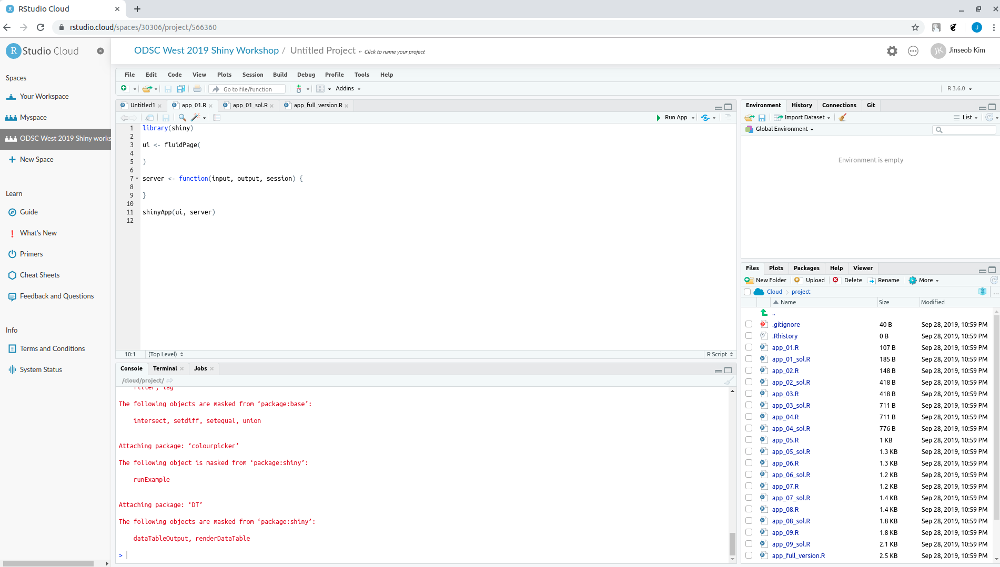
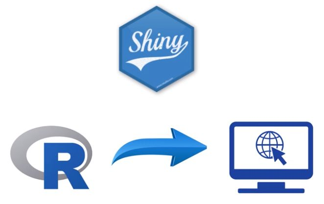
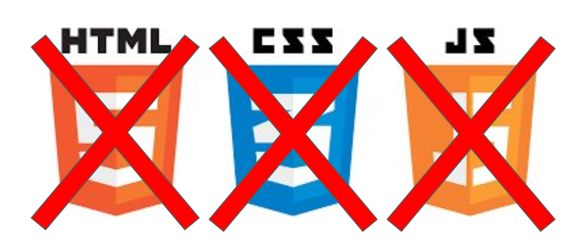
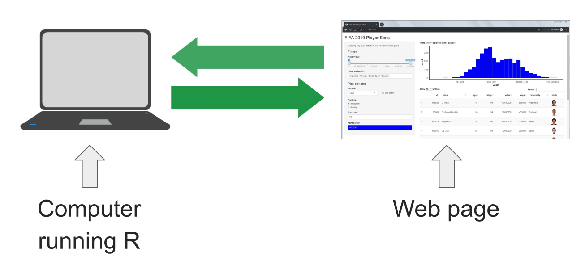
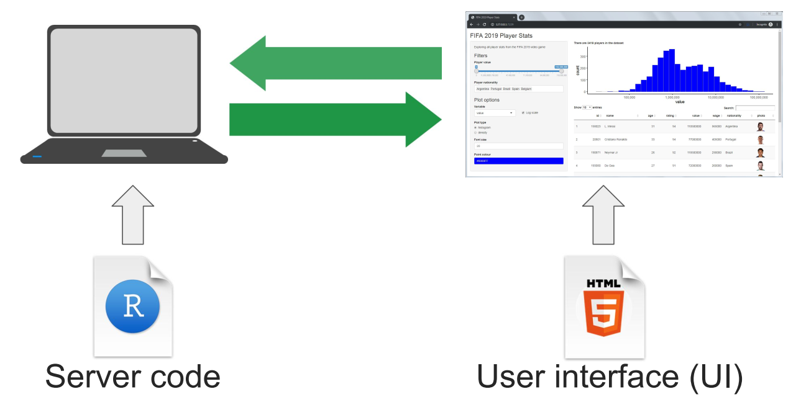
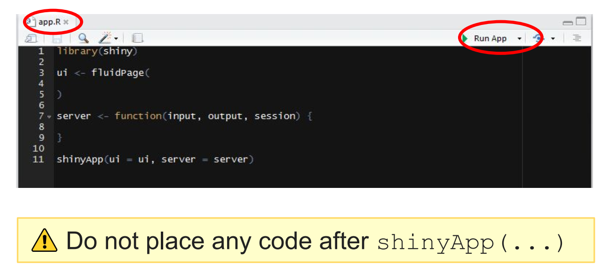
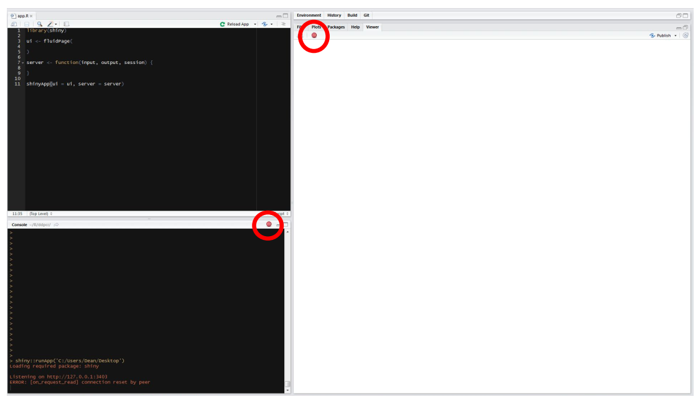

```{r setup, include=FALSE}
options(htmltools.dir.version = FALSE)
knitr::opts_chunk$set(echo = FALSE, fig.align = "center")
library(knitr);library(DT);library(dplyr);library(data.table);library(rmarkdown);library(readr);library(purrr);library(tidyr)
```


layout: true

<div class="my-footer"><span><a href="https://www.zarathu.com">Zarathu Co.,Ltd</a>   
&emsp;&emsp;&emsp;&emsp;&emsp;&emsp;&emsp;&emsp;&emsp;&emsp;&emsp;&emsp;&emsp;
&emsp;&emsp;&emsp;&emsp;&emsp;&emsp;&emsp;&emsp;&emsp;&emsp;&emsp;&emsp;&emsp;
<a href="https://github.com/jinseob2kim">김진섭</a></span></div> 

---

# 실습 목표

.large[
 * [RStudio cloud](https://rstudio.cloud/) 를 이용, 클라우드 환경에서 R을 쓸 수 있다.
]

--

.large[
 * `app.R` 파일에 Shiny의 **ui**와 **server** 코드를 입력할 수 있다.
 
 
 * **Reactivity** 를 이해한다.
]


--

.large[
 * `fluidPage`의 `sidebarLayout` 레이아웃을 이용, 왼쪽에는 UI 옵션, 오른쪽에는 해당되는 결과를 보여줄 수 있다.
]

--
.large[
 * [DT](https://rstudio.github.io/DT/) 패키지로 데이터를, [ggplot2](https://ggplot2.tidyverse.org/) 로 히스토그램을 보여줄 수 있다. 

]

--
.large[
 * [shinyapps.io](https://www.shinyapps.io/) 에 app 을 배포할 수 있다. 
]


---

# Shiny 예

.large[
* [공식 갤러리](https://shiny.rstudio.com/gallery/)


* [유저 앱 모음](http://www.showmeshiny.com/)


* [통계분석 웹 by Zarathu](http://app.zarathu.com/) 


* [네트워크분석 by Zarathu]()


* [심장 압력 계산 by Zarathu]()


* [압축 파일에 담긴 결과 보기 by Zarathu](http://147.47.68.165:1111/cdm/estimation)
]


---

class: center, middle

# 시작하기 전에


---

# [RStudio cloud](https://rstudio.cloud/)

.large[
 * **클라우드 환경**에서 RStudio 무료 이용.
 
 
 * 성능은 나쁘지만(1 코어, 램 1기가), 실습용으론 충분.
]


<a href="https://rstudio.cloud/"></a>


---

# 실습환경 만들기: RStudio cloud 

**Step 1:** https://rstudio.cloud 회원 가입

**Step 2:** https://rstudio.cloud/spaces/30306/join?access_code=s4hEiPXQF%2BjosPclQEzgTtR0mPWDuh7Dhr2O7wAg 들어가서 **"Join Space"** 클릭

**Step 3:** 위쪽 **"Projects"** 클릭 후, **"New Project"** 를 눌러 **"New Project from Git Repo"** 선택. Repo 주소는 https://github.com/jinseob2kim/shiny-workshop-odsc2019.


모든 강의자료는 RStudio cloud 에 들어 있습니다. 


---

# 실습환경 만들기: 개인 PC

**Step 1:** 패키지 설치

```r
install.packages(c("shiny", "ggplot2", "dplyr", "DT", "colourpicker", "readr")) 
```


<br>
**Step 2:** https://github.com/jinseob2kim/shiny-workshop-odsc2019 들어간 후 

<br>

**Step 3:** 녹색 **"Clone or download"** 클릭 후 **"Download ZIP"** 을 눌러 자료 다운. 


---

# 실습파일 

.large[
* `app_01.R` - `app_09.R`: 9단계 문제 


* `app_01_sol.R` - `app_09_sol.R`: 해답


* `app_full_version.R`: [최종 완성 앱](https://daattali.shinyapps.io/nba2018/)


* **data** 폴더: [Kaggle의 NBA 2018/19 시즌 스탯 데이터](https://www.kaggle.com/schmadam97/nba-regular-season-stats-20182019)


* **docs** 폴더: 이 슬라이드 파일 

]


---

class: center, middle

# Shiny 소개


---

### [Shiny](https://shiny.rstudio.com/) is an R package that makes it easy to **build web applications with R**


```{r, align = "center"}

```

---

# 웹 개발 지식 없어도 됨

```{r, align = "center"}

```


---

# Shiny app

```{r, align = "center"}

```

---

# UI & SERVER

```{r, align = "center"}

```


---

# UI & SERVER

<center>
<a href="https://codingclubuc3m.rbind.io/post/2018-06-19/"></a>
</center>


---

# Make basic App

* `app.R` 파일 만들고(**이름 바뀌면 안됨**)

* `ui` 와 `server` 코드 작성 후 `shinyApp` 으로 마무리. **Run App** 눌러 실행.

  - `ui.R`, `server.R` 따로 작성할 수도 있음. 개인 취향


```{r, align = "center"}

```


---

# Stop App

**ESC** or 빨간 **Stop** 버튼

```{r, align = "center"}

```

---

# 실습: `app_01.R`

.large[
* `shiny` 패키지 로드 후, 아래와 같이 데이터를 읽는다.

```r
players <- read.csv("data/nba2018.csv")
```

* 데이터 확인: **ui** 에 **데이터 행 수** 를 보여주기.


* 데이터 탐색: 선수들 **나이(age), 연봉(salary), 키(height) 의 범위**는?

]

---

# 실습 목표

.large[
 * [RStudio cloud](https://rstudio.cloud/) 를 이용, 클라우드 환경에서 R을 쓸 수 있다.
 
 
 * `app.R` 파일에 Shiny의 **ui**와 **server** 코드를 입력할 수 있다.
 
 
 * **Reactivity** 를 이해한다.
 
 
 * `fluidPage`의 `sidebarLayout` 레이아웃을 이용, 왼쪽에는 UI 옵션, 오른쪽에는 해당되는 결과를 보여줄 수 있다.
 
 
 * [DT](https://rstudio.github.io/DT/) 패키지로 데이터를, [ggplot2](https://ggplot2.tidyverse.org/) 로 히스토그램을 보여줄 수 있다.
 
 
 * [shinyapps.io](https://www.shinyapps.io/) 에 app 을 배포할 수 있다. 
]


---

class: center, middle

# END


